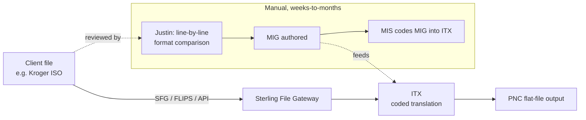
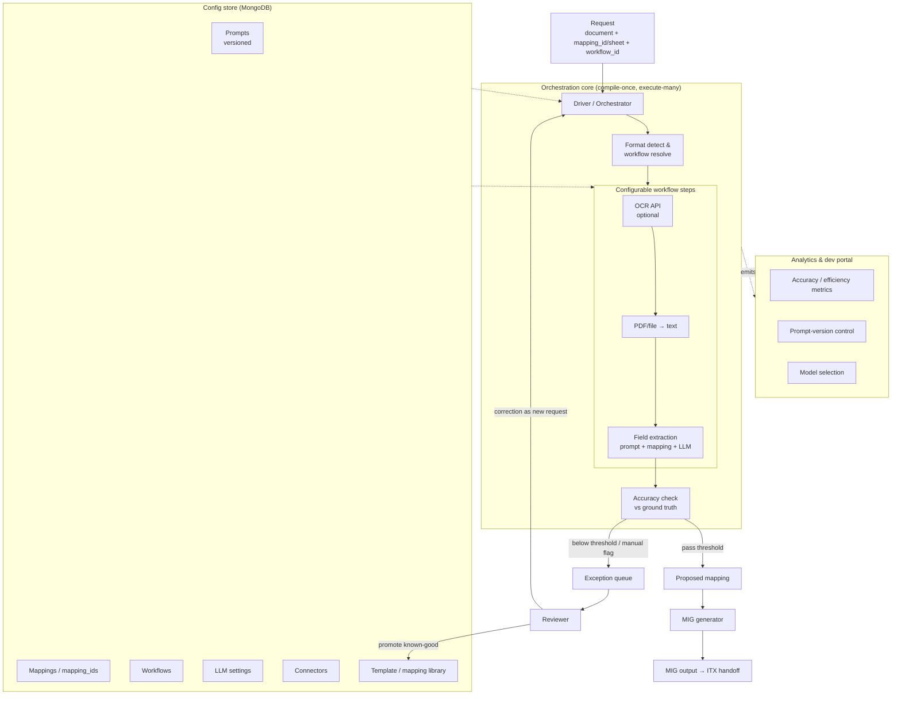
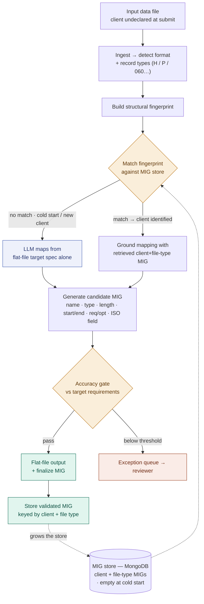
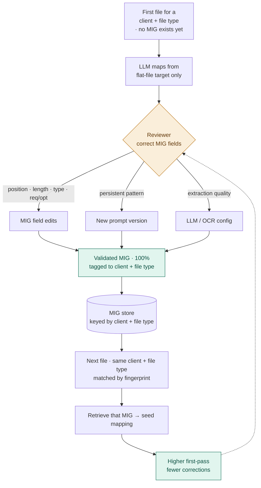
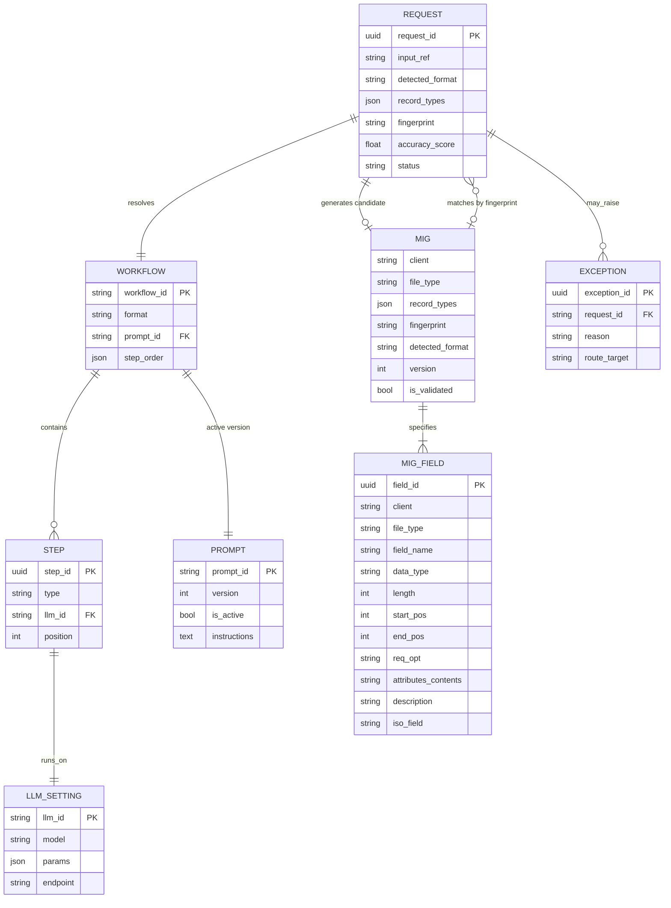
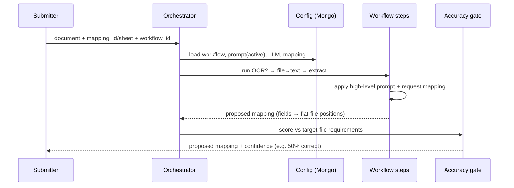
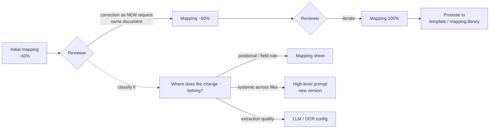
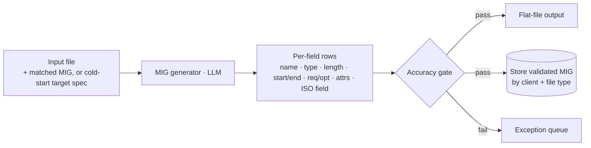
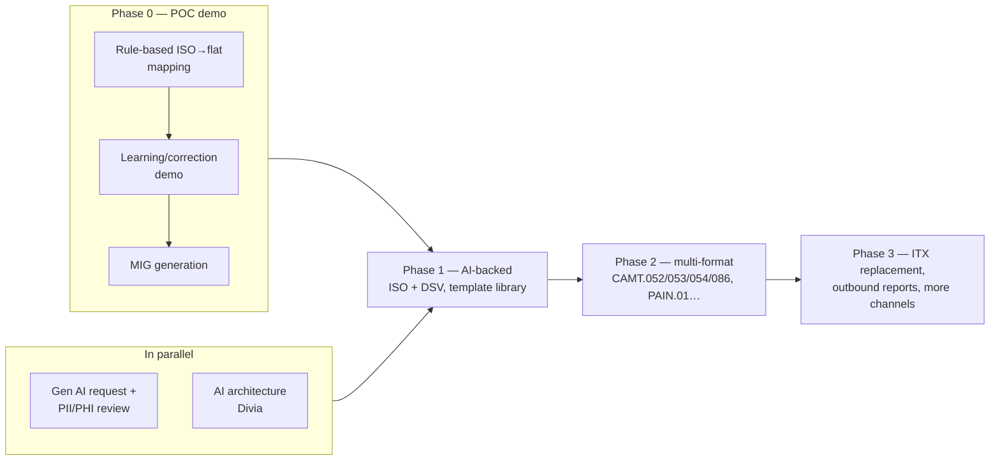

# A2A Any-to-Any File Mapping — POC Architecture Design

**Program:** Client payment-file translation into PNC-standard formats (ITX successor)
**POC scope:** ISO → integrated-payables flat file (DSV → flat as second format)
**Author:** DSI / Data Science Innovation
**Status:** Draft for internal DS review — pre-governance

---

## 1. What the stakeholders asked for

The POC has to demonstrate three — and only three — capabilities. Everything in this design exists to serve them, and anything that expands into a full multi-client platform before these are proven is out of scope.

| # | Capability | What "done" looks like for the POC |
|---|------------|-----------------------------------|
| **1** | **Initial mapping** | A client ISO file is submitted and the tool returns a proposed field-level mapping to the PNC flat-file standard (e.g. an initial pass that is ~50% correct). |
| **2** | **Learning & improvement** | Reviewer corrections are applied iteratively and the tool improves across successive files (50% → 60% → 100%), learning reusable rules (e.g. `P + WR = wire`) rather than treating each file in isolation. |
| **3** | **MIG generation** | The tool emits a MIG — the implementation document handed to ITX — including the column-O transformation instructions (positional moves, numeric/alpha, domestic/international, record identifiers). |

The design principle underneath all three is the one already chosen for A2A: **compile-once, execute-many** — high-level workflow logic is authored and versioned once; per-file specifics ride in on the request.

---

## 2. Current state (why this exists)

Today the path from a client file to a processable PNC file is manual and slow:



- Justin compares the client format to the PNC flat-file format line by line; clarification loops with the client run **weeks to months**.
- He authors a **MIG**, MIS codes it into **ITX**, and ITX applies the coded translation.
- Mappings in production may be a year old; there is no learning, no reuse library, no accuracy visibility.

**Target for the POC:** collapse that weeks-to-months implementation effort to **~5–10 minutes** for the mapping + MIG draft, with a human reviewer still in the loop. ITX stays in place during the POC; full ITX replacement is the 1–2 year (broader channels 3–5 year) vision, not this deliverable.

---

## 3. Target POC architecture (overview)

A configuration-driven **orchestrator** receives a document plus a mapping reference, resolves an any-to-any workflow, runs the steps, checks accuracy, and either returns output or routes to an exception queue. Prompts, mappings, workflows, LLM settings and connectors all live in config (MongoDB), never in code.



**Component responsibilities**

- **Driver / Orchestrator** — accepts the request (document + `mapping_id` or inline mapping sheet + `workflow_id`), pulls config, executes the workflow, and owns the accuracy gate. Stateless per request; all state is in config + request payload.
- **Format detect & workflow resolve** — identifies or infers the incoming format (ISO, DSV, or a hybrid with characteristics of both) and selects the applicable any-to-any workflow. A file that mixes ISO/DSV traits is evaluated against applicable rules rather than forced into a rigid label.
- **Workflow steps** — declarative, reorderable. Each step (OCR, file→text, extraction) is its own API capability so a step can be added, skipped, or swapped by config. Real-time DSV example: only the date-time field needs conversion, so the workflow can be a single-field transform, not a full re-map.
- **Extraction** — runs the request-level **mapping** together with the versioned high-level **prompt** against the selected **LLM**.
- **Accuracy check** — compares extraction against target-file requirements / ground truth; routes below-threshold or manually-flagged files to the exception queue.
- **MIG generator** — turns the accepted mapping into the ITX-ready MIG.
- **Config store (MongoDB)** — workflows, prompts, mappings, LLM settings, connectors, and the reusable template/mapping library.
- **Analytics & dev portal** — metrics, prompt versioning, model selection (Section 10).

---

## 4. End-to-end workflow

Sections 5–7 detail each capability in isolation; this section shows how they compose into one running system, under two defining constraints. First, **MIGs are client + file-type specific**, and the store starts empty — so on the earliest files there is nothing to retrieve and the LLM must map from scratch. Second, **the client is undeclared when a file is submitted**, so the platform can't look a MIG up by client; it matches the file's structural fingerprint instead. Three views follow: the **request lifecycle**, the **cold-start learning loop**, and the **config data model** they run on.

### 4.1 Request lifecycle

MIGs are stored per **client + file type**, but the client isn't declared at submission — so the platform matches the file's **structural fingerprint** against the store to find (and thereby identify) the right client+file-type MIG. Early on the store is empty, so nothing matches and the LLM maps from the PNC flat-file target alone; that validated result becomes the first stored MIG for that client and file type.



**Summary.** Because the store begins empty and the client is undeclared, the first files can't be matched to anything — the LLM maps them against the PNC flat-file target alone. As validated MIGs accumulate, an incoming file's structural fingerprint matches the stored **client + file-type** MIG, which both grounds the mapping and identifies the client. Every run emits a candidate MIG in the fixed columnar schema; passing files yield the flat file plus a finalized MIG stored under its client and file type, growing the store for that client's future files. `REQUEST.status` runs `received → fingerprinted → (matched | cold-start) → mapping → scored → (accepted | exception) → mig_stored`; each correction is a new request against the same `input_ref`.

### 4.2 Cold-start learning loop

Because the store starts empty, the first file for every new **client + file type** is mapped by the LLM from the flat-file target alone and corrected by a reviewer at the MIG-field level. The finalized MIG is validated, tagged to that client and file type, and stored; the next file that fingerprints to the same client+file-type retrieves it and starts far closer to correct.



**Summary.** Day one has no MIGs, so the first file of each client + file type is carried entirely by the LLM against the PNC target and corrected field-by-field — position, length, type, Req/Opt, ISO field. The finalized MIG is validated, tagged to that client and file type, and stored. From then on, any file that fingerprints to the same client+file-type retrieves that MIG and begins near-correct. Corrections still route to a MIG-field edit, a new prompt version, or an LLM/OCR change, but the durable output of every loop is a stored client+file-type MIG that lifts first-pass accuracy for that client's future files of that type.

### 4.3 Config data model

The durable unit of knowledge is the **MIG**, identified by **client + file type** (with its record types). Because the client is undeclared at submit and the store may be empty, `fingerprint` is a match index — not the identity — used to resolve an incoming file to a stored MIG. Each MIG owns a set of `MIG_FIELD` rows carrying the exact columnar spec.



**Summary.** `client + file_type` is the natural key of a MIG; `record_types` sit inside it, and `MIG_FIELD` holds the exact columns you defined — field name, data type, length, start/end position, Req/Opt, attributes/contents, description, ISO field. `fingerprint` is only a submit-time match index, since the client isn't known yet; a hit resolves the client+file-type MIG (and reveals the client), while an empty store or a first-seen client+file-type simply returns nothing and the LLM maps from the target. `REQUEST` generates one candidate MIG (write side) and may match a stored one (read side) — the two `REQUEST–MIG` edges are the write and read of the same store as it fills.

### 4.4 Fingerprint & match policy

A fingerprint is a **data-independent structural signature** — computed from the file's shape, never its values — so it can be derived before the client is known. It composes:

- **Format family** — ISO 20022, DSV, or hybrid (hard gate).
- **Record-type set** — the record identifiers present (e.g. `H`, `P`, the fixed `060`) and their sequence (hard gate).
- **Layout signature** — for fixed-width: record length, field count, and the offsets/lengths of anchor fields; for delimited: delimiter, column count, and header signature.
- **Control markers** — header/trailer records, control totals, and any embedded format-version tag.

Matching runs the fingerprint against `mig_specs` and resolves to one of three bands:

| Band | Condition | Action |
|---|---|---|
| **Auto-match** | Hard gates equal + layout similarity ≥ 0.95 | Use the stored client+file-type MIG to ground mapping; client taken as identified |
| **Ambiguous** | Layout similarity 0.80–0.95, or more than one client's MIG matches | Propose the top candidate(s) but route for reviewer / secondary confirmation before trusting |
| **No match** | Below 0.80, or store empty / first-seen structure | Cold start — the LLM maps from the flat-file target alone; the result becomes a new MIG |

**Drift vs new structure.** When a client changes their format the fingerprint deviates. A **minor** deviation (still auto- or ambiguous-match) keeps the same client+file-type MIG and routes corrections into a **new MIG version** — history retained, so a portal drift alert ties to a specific version bump. A **major** deviation deliberately misses and is handled as a new structure (cold start) that yields a separate MIG. The similarity thresholds are the dial between *re-version* and *treat as new*.

**Collision & confirmation.** Because the client is undeclared, two clients with near-identical layouts can land in the Ambiguous band. A post-extraction signal — the sender / pin field (which already derives sender→currency) or the intake connection identity — confirms the client before the MIG is trusted, or before a new MIG is written under the wrong client. Auto-matches remain subject to the accuracy gate, so a wrong match surfaces as a low score rather than a silent error.

---

## 5. Capability 1 — Initial mapping

**Goal:** submit a client file, get back a proposed field-level mapping to the PNC flat-file standard.



**Design points grounded in the transcripts**

- **Prompt vs mapping separation is strict.** The prompt holds *high-level workflow instructions only* — "convert document to text," "extract fields." Anything file-specific (a positional rule such as account-number range `0–10 → 0–12`, or "client value at position 82 moves to position 40") lives in the **mapping**, keyed at the request level. This is what keeps 10 clients × 10 formats from exploding into 100 bespoke prompts.
- **Target-file-driven detection.** The tool uses the known PNC flat-file target requirements to surface missing values, reordered fields, and type mismatches — it doesn't need a perfect client spec to produce a first pass.
- **Fixed vs variable structure.** The flat file has fixed record identifiers (e.g. the hard-coded `060` record); client files may use their own (`H` header, `P` payment). The mapping reconciles the two.
- **First pass is expected to be partial.** 50–60% correctness on the first run is the design assumption, not a failure — Capability 2 closes the gap.

---

## 6. Capability 2 — Learning & improvement

**Goal:** corrections improve the result on the current file *and* carry forward to future files. This is the differentiating capability and the emphasis of the demo, since the model already maps.



**How correction works**

- Each correction is submitted as a **new API request against the same document** — no in-place mutation, so every iteration is reproducible and auditable.
- The reviewer's real decision is **where the fix belongs**, and the portal must make this explicit:
  - **Mapping** — positional/field-specific corrections (the account-range example, position 82→40).
  - **Prompt (new version)** — when the *same* inaccuracy persists across multiple files and mapping tweaks don't resolve it, the high-level instruction itself is wrong and needs a new version.
  - **LLM / OCR config** — when errors trace to text conversion, OCR, or model quality rather than instructions.
- **Rule generalization.** The tool should learn portable rules — `P + WR = wire`, `ACH = ACH transaction`, pin-number → sender/currency when sender IDs are absent — and apply them across clients, not just the file they were learned on.

**Reuse library (how learning compounds)**

- Finalized mapping sheets are stored as **templates** keyed by `mapping_id`.
- On a new file, the library finds the nearest known format ("this looks like the Walmart format") and seeds the mapping from it; the reviewer adjusts and resubmits.
- **QA vs production discipline:** iteration/correction happens in **QA**. **Production / straight-through processing uses finalized mappings only** — no rapid changes against live traffic.
- Unknown fields with no matching rule still fall to manual investigation / a client call — the tool narrows the manual surface, it doesn't eliminate it.

---

## 7. Capability 3 — MIG generation

**Goal:** for every flat-file generation, emit a **MIG** — the field-level specification that both drives the flat-file output and, once validated, becomes the retrievable mapping asset for that client and file type.

The MIG is a per-record-type table. Each row specifies one target field:

| Column | Meaning |
|---|---|
| Field name | Target flat-file field |
| Type | Data type (numeric / alpha / …) |
| Length | Field length |
| Starting position | Offset start in the flat file |
| Ending position | Offset end |
| Req / Opt | Required or optional |
| Attributes / Contents | Fixed values, enumerations, formatting |
| Description | Human-readable definition |
| ISO fields | Corresponding ISO 20022 source element(s) |

Two properties matter as much as the columns:

- **Client + file-type specific.** A MIG belongs to one client and one file type. Since the client isn't declared at submission, an incoming file is matched to the right stored MIG by its **structural fingerprint** — a hit both retrieves the MIG and identifies the client. The client is confirmed at reviewer validation before the MIG is stored.
- **Nothing to retrieve at first.** The store starts empty, so early files (and any first-seen client + file type) have no MIG to ground them; the LLM produces the MIG from the PNC flat-file target spec and the input file alone. The reviewer-validated result is stored under its client and file type and becomes retrievable for that client's future files of the same type.



For the POC, the reference MIGs Justin/Julie are formatting (ISO→flat and DSV→flat) are the **ground truth** the generated MIG is scored against — and the first client+file-type entries in the store.

---

## 8. Configuration & data model (MongoDB)

Everything that changes behavior is config, not code. Indicative collections:

- **`workflows`** — ordered step lists (`ocr?` → `file_to_text` → `extract`); a workflow can be a full translation or a single-field conversion.
- **`prompts`** — high-level instructions, **versioned**; exactly one `active` version per prompt at a time.
- **`mig_specs`** — the reusable knowledge base: one document per validated MIG, identified by `client` + `file_type` (+ `record_types`), and indexed by `fingerprint` for submit-time matching. Starts empty.
- **`mig_fields`** — the per-field rows of each MIG (name, type, length, start/end position, req/opt, attributes/contents, description, ISO field); embedded in `mig_specs` or referenced.
- **`llm_settings`** — model, params, endpoint (on-prem vs Foundry vs GPT-5), per workflow/step.
- **`connectors`** — input channels and downstream endpoints (SFG, FLIPS, API…).

**Matching, not client lookup.** The client isn't declared at submission and the store may be empty, so the orchestrator computes a structural fingerprint (format + record types + layout signature) and matches it against `mig_specs`. A hit resolves the client+file-type MIG and reveals the client; a miss — cold start, or a first-seen client/file-type — returns nothing, and the LLM maps from the flat-file target alone. The validated MIG it produces is written back under its client and file type as the first entry for that structure.

**Prompt versioning behavior (required):** promoting a new prompt version marks the previous version `inactive` and the new one `active`, and the history records what changed and which config previously worked.

**Request shape (conceptual):**

```json
{
  "input_ref": "…",
  "workflow_id": "iso_to_flat_v1",
  "detected": { "format": "ISO20022", "record_types": ["H", "P"], "fingerprint": "…" },
  "matched_mig": null
}
```

The request carries no client and no pre-assigned mapping; `matched_mig` is null on a cold start, and otherwise resolves to a stored client+file-type MIG.

---

## 9. Exception handling & accuracy gating

- The **exception queue** is a separate component, triggered **automatically** (below an accuracy rule) or **manually** (reviewer routes a file in).
- Accuracy is scored against ground truth; the **70%** figure from the discussion is an example threshold, not a fixed policy — thresholds should be configurable per workflow/client.
- Error attribution matters because it routes the fix: extraction errors can originate in the **mapping, prompt, LLM, text conversion, or OCR**, and the reviewer/portal needs enough signal to tell them apart.

---

## 10. Analytics & developer portal

Primarily an **internal dev/engineering** surface, with selected operational views exposed more broadly.

- **Client-level analytics** — accuracy and efficiency compared across clients (Kroger vs Walmart), including processing time (the 10-min vs 1-min contrast).
- **Stuck-case visibility** — flag files where *mapping changes stop moving accuracy*, signalling the high-level prompt needs revision rather than more mapping edits.
- **Prompt-version control** — active/inactive state, diff of what changed, which version last worked.
- **Model selection** — visible and switchable; supports cost/quality comparison, e.g. GPT-5 vs an on-prem ~90B option vs ~235B.
- **Template library view** — which mappings are validated for which clients/formats, to seed future onboarding.

---

## 11. Governance, security & environments

This gates go-live, so it runs **in parallel** with build, not after.

- **Gen AI request + PII/PHI review** is required; end-to-end approval is ~**1–1.5 months** (Hassan is coordinating the form/request).
- **On-prem / Foundry first.** ACH transactional data already lives in PNC private data centers, so **Foundry** is a candidate for the AI path pending governance review. Prototyping proceeds with **on-prem models + approved test prompts** while the request is in flight.
- **Integrity rule:** unapproved LLM use must **not** be presented as a completed POC. The rule-based ISO path (Section 12) is what lets the demo progress honestly before AI approval lands.

---

## 12. Delivery phasing



- **Phase 0 (this POC):** a **rule-based** ISO→flat implementation is legitimate to demonstrate mapping + learning + MIG quickly, while the AI architecture is built alongside. Keep it to **one ISO file → one flat format**; do not expand into a multi-client platform before the three capabilities are proven.
- **Parallel tracks:** Divia builds the AI architecture; Hassan drives governance. Justin/Julie deliver the verified, color-coded ISO→flat and DSV→flat MIG + mapping (the ground truth) — expected imminently.
- **Later:** a **funding request** for next year and **server-architecture changes** are sequenced *after* POC steps 1 and 2, not before. Broader formats (CAMT.052/053/054/086, PAIN.01) and outbound reports (e.g. PAIN.002) follow.

---

## 13. Open decisions to close with the DS team

1. **Similarity matching** — what fingerprints a format for the template library (record identifiers, field signatures, positional layout)?
2. **Accuracy scoring** — field-level exact match vs weighted/critical-field scoring, and per-client thresholds.
3. **Rule store** — do generalized rules (`P+WR=wire`) live inside mappings, as a shared rule collection, or both?
4. **Ground-truth management** — how MIG/mapping references are versioned as clients change formats.
5. **Foundry vs on-prem model split** — which steps run where under governance constraints.
6. **MIG fidelity bar** — how close to Justin/Julie's formatted MIG the generated MIG must be to count as "done."
7. **Exception-handling surface** — a dedicated exception service with a reviewer worklist UI, or a `status` field plus a table view for the POC?
